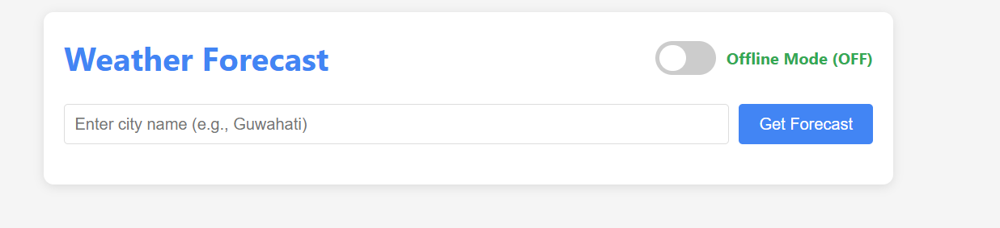
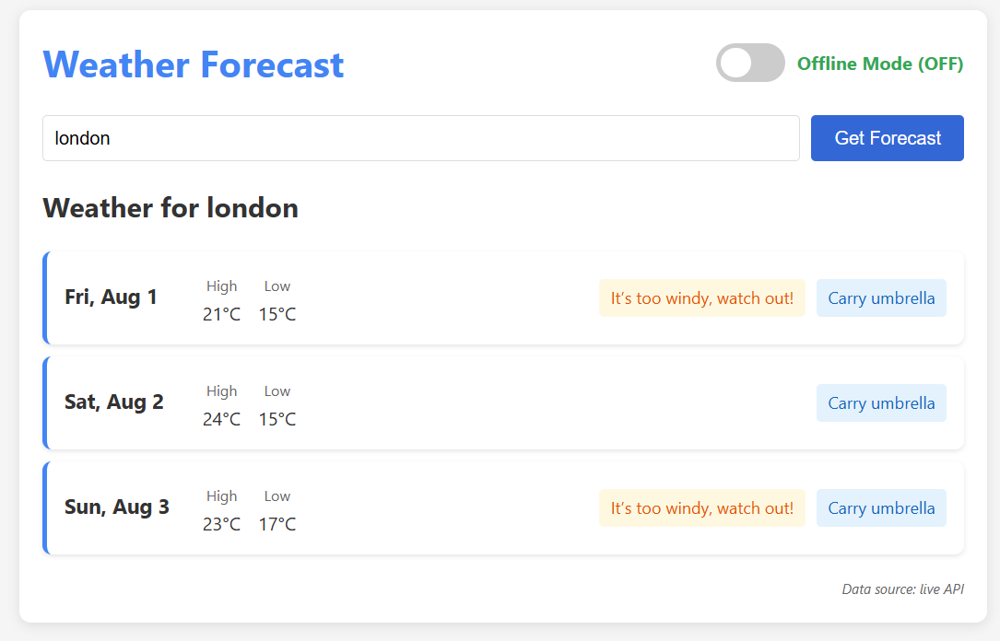
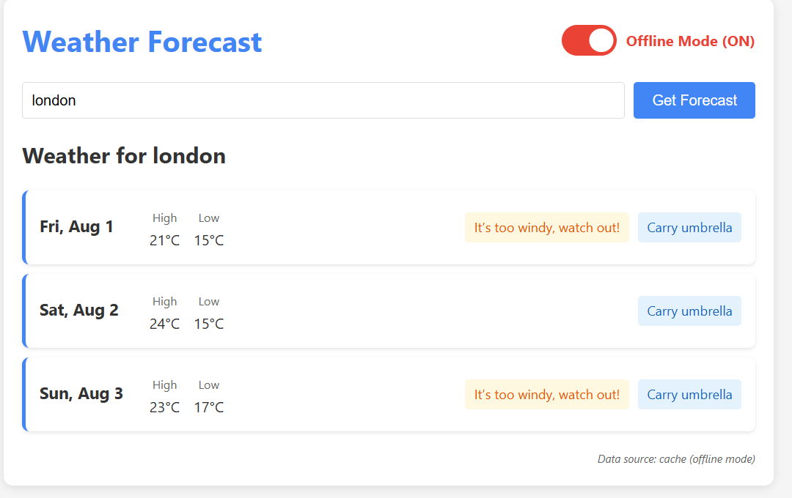
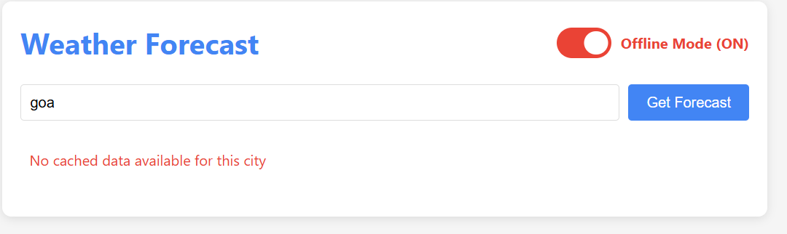
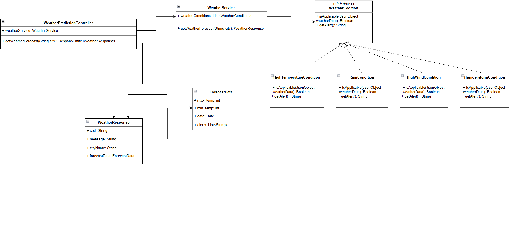
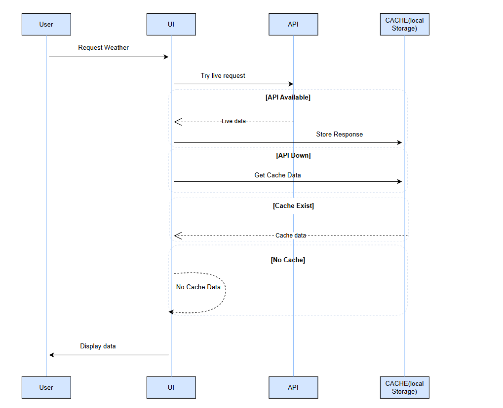

# Weather Prediction Application

A Spring Boot application that provides weather forecasts with smart caching and offline capabilities.

## Features

- Weather forecast lookup by city name
- Automatic caching of weather data
- Offline mode support
- Smart weather alerts (rain, high temperature, wind, storms)

## UI Screenshots

### Online Mode
#### Search Page

*Enter your city name to get weather forecast*

#### Results Page

*Weather forecast results with alerts (Live API)*

### Offline Mode
#### Results from Cache

*Weather forecast from cached data when API is unavailable*

#### No Cache Data Available

*Error message when API is down and no cache exists*

## Architecture

### UML  Diagram


### Sequence Flow


## Technology Stack

- **Backend**: Java 17, Spring Boot 3.5.3
- **Frontend**: HTML5, CSS3, JavaScript
- **Build Tool**: Maven
- **Containerization**: Docker
- **API**: OpenWeatherMap

## Getting Started

### Prerequisites

- Java 17 or higher
- Maven 3.6 or higher
- Docker (optional)

### Local Development

1. Build the application:

    ```bash
    mvn clean install
    ```

2. Run the application:

    ```bash
    mvn spring-boot:run
    ```

3. Access the application at [http://localhost:8080](http://localhost:8080)

### Docker Deployment

1. Build Docker image:

    ```bash
    docker build -t weather-prediction:latest .
    ```

2. Run Docker container:

    ```bash
    docker run -p 8080:8080 weather-prediction:latest
    ```

3. Access the containerized application at [http://localhost:8080](http://localhost:8080)

## API Documentation

| Endpoint                   | Method | Description                     |
|----------------------------|--------|---------------------------------|
| `/forecast?city={cityName}` | GET    | Get weather forecast for a city |

### Example Request

```bash
curl --location 'http://localhost:8080/forecast?city=guwahati'
```

### Example Response

```json
{
    "cod": "200",
    "message": "0",
    "city": "guwahati",
    "forecastData": [
        {
            "min_temp": 299.0,
            "max_temp": 306.0,
            "dt_txt": "2025-08-01",
            "alerts": [
                "Carry umbrella"
            ]
        },
        {
            "min_temp": 299.0,
            "max_temp": 305.0,
            "dt_txt": "2025-08-02",
            "alerts": [
                "Carry umbrella"
            ]
        },
        {
            "min_temp": 299.0,
            "max_temp": 300.0,
            "dt_txt": "2025-08-03",
            "alerts": [
                "Carry umbrella"
            ]
        }
    ]
}
```

### API Documentation (Swagger/OpenAPI)

The API documentation is available through Swagger UI at:
- Swagger UI: [http://localhost:8080/swagger-ui.html](http://localhost:8080/swagger-ui.html)
- OpenAPI JSON: [http://localhost:8080/v3/api-docs](http://localhost:8080/v3/api-docs)

You can explore and test all API endpoints interactively through the Swagger UI interface.

## Configuration

The application can be configured using YAML files:

- Development: `application-dev.yml`
- Production: `application-prod.yml`

## Testing

Run unit tests:

```bash
mvn test
```
